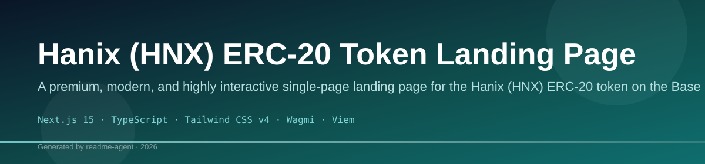
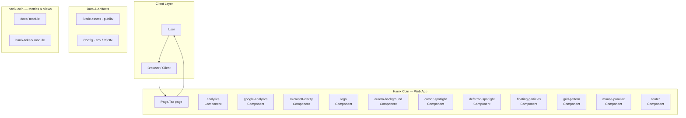
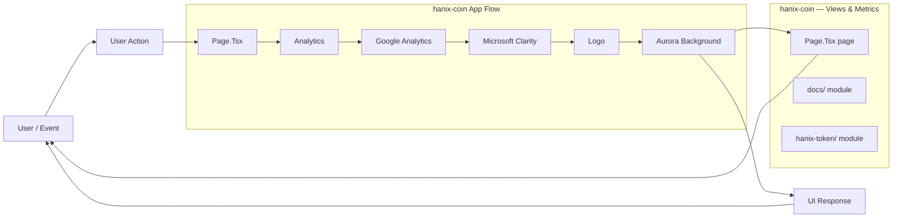
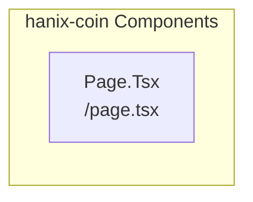
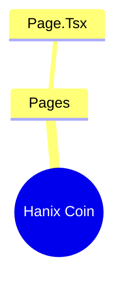

# Hanix (HNX) Base Token Landing Page

A premium, modern landing page built with Next.js 15 and Tailwind CSS to promote the Hanix (HNX) ERC-20 token on the Base network.

## Overview

This project is a single-page application designed to serve as the primary marketing and information hub for the Hanix (HNX) token. It utilizes modern web technologies like Next.js 15, TypeScript, and Tailwind CSS to create a visually appealing and highly interactive user experience. Key functionalities include wallet connection (via Wagmi/RainbowKit), displaying real-time token balance, explaining token utility, and presenting the project roadmap.

## Key Features

- Wallet Connection: Allows users to connect their crypto wallets (e.g., MetaMask) to interact with the token.
- Real-time Balance Display: Shows the connected user's balance of the HNX token on the Base network.
- Token Utility Explanation: Dedicated sections detailing the use cases and tokenomics of HNX.
- Roadmap Visualization: Presents the project's future milestones and development plan.
- Responsive Design: Built using Tailwind CSS, ensuring optimal viewing on various devices.

## Technology Stack

- Next.js 15
- TypeScript
- Tailwind CSS v4
- Wagmi
- Viem
- Framer Motion
- React

# Hanix (HNX)

A premium, modern landing page built with Next.js 15 and Tailwind CSS to promote the Hanix (HNX) ERC-20 token on the Base network.

This project serves as the primary marketing and information hub for the Hanix (HNX) token. It is a single-page application designed to provide a visually appealing and highly interactive user experience, utilizing modern web technologies like Next.js 15, TypeScript, and Tailwind CSS.

## ✨ Features

*   **Wallet Connection:** Allows users to connect their crypto wallets (e.g., MetaMask) to interact with the token.
*   **Real-time Balance Display:** Shows the connected user's balance of the HNX token on the Base network.
*   **Token Utility Explanation:** Dedicated sections detailing the use cases and tokenomics of HNX.
*   **Roadmap Visualization:** Presents the project's future milestones and development plan.
*   **Responsive Design:** Built using Tailwind CSS, ensuring optimal viewing on various devices.

## 🚀 Tech Stack

*   Next.js 15
*   TypeScript
*   Tailwind CSS v4
*   Wagmi
*   Viem
*   Framer Motion
*   React

## ⚙️ Getting Started

Follow these steps to set up and run the project locally.

### Installation

1.  **Install Dependencies:**
    ```bash
npm install next react react-dom tailwindcss postcss autoprefixer framer-motion wagmi viem @rainbow-google/rainbowkit
    ```
2.  **Configure:** Ensure `tailwind.config.js` and `postcss.config.js` are set up according to Next.js best practices.
3.  **Setup Provider:** Set up the Wagmi provider in the root layout file.

### Running the Project

```bash
npm run dev
```

Open [http://localhost:3000](http://localhost:3000) to view the landing page.

## 🛠️ Configuration

The primary configuration is handled in `src/lib/constants.ts`. You must update the following placeholders with the live Hanix token details:

*   `CONTRACT_ADDRESS`
*   `TOKEN_SYMBOL`
*   `BASE_SCAN_URL`

## 🧭 Usage

The landing page is accessed via the root route (`/`). Users interact with the application by:

1.  Connecting their crypto wallet.
2.  Viewing their real-time HNX token balance.
3.  Reading detailed information about the token's utility and roadmap.

## 📜 Scripts

*   `npm run dev` — Development server
*   `npm run build` — Production build
*   `npm run start` — Start production server
*   `npm run lint` — ESLint

# hanix-coin

## Setup Guide

### Frontend Setup

```bash

npm install
npm run dev     # development
npm run build && npm start   # production
```

Open `http://127.0.0.1:3000` (or the port shown in the terminal).

### Running the Application

1. **Start web app** — `npm run dev` in `./`

```bash
cd .
npm install
npm run dev
```

## System Architecture

High-level system design, data flows, API map, and workflow pipelines derived from the repository structure.

### System Architecture



### Data Flow & Charts Pipeline



### Component & API Map



### Application Page Map


